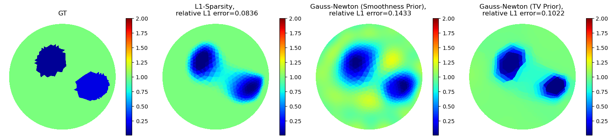
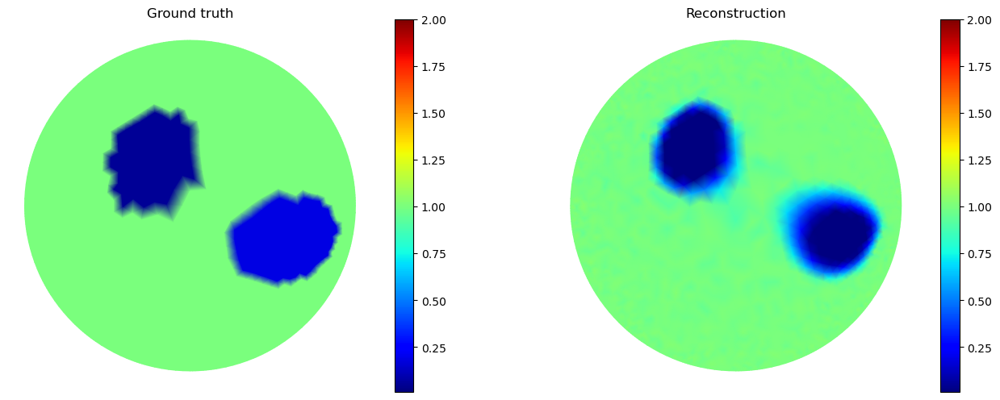

# EIT Complete Electrode Model

This repository contains a FEM solver for the complete electrode model (CEM) used in electrical impedance tomography (EIT). The FEM solver is implemented in FenicsX. The Jacobian computation follows the work by Margotti ([Section 5.2.2.](https://publikationen.bibliothek.kit.edu/1000048606))

This solver was used in the submission to KTC2023 by the team Alexander Denker, Zeljko Kereta, Imraj Singh, Tom Freudenberg, Tobias Kluth, Simon Arridge and Peter Maass from University of Bremen and University College London.

### Background 

Let $\Omega$ be the domain with boundary $\partial \Omega$ and $L$ electrodes $e_l \subset \partial \Omega$ for $l=1,\dots,L$. The electric potential $u$ is governed by the following PDE 

$$ - \nabla \cdot(\sigma \nabla u) = 0 \quad \text{in } \Omega, $$

where $\sigma$ is the conductivity distribution. In EIT we apply a current $I = (I_1, \dots, I_L)$ on the electrodes and measure the voltage $U = (U_1, \dots, U_L)$. In the CEM we model this with boundary conditions

$$ u + z_l \sigma \frac{\partial u}{\partial \nu} = U_l, \quad \text{on } e_l, l=1,\dots,L $$
$$ \sigma \frac{\partial u}{\partial \nu} = 0, \quad \text{on } \partial \Omega \setminus  \cup_l e_l$$
$$ \int_{e_l} \sigma \frac{\partial u}{\partial \nu} ds = I_l, \quad \text{on } e_l, l=1,\dots,L $$

where $z = (z_1, \dots, z_L)$ are contact impedances. Further, we have an additional mean-free condition for the potential

$$ \sum_{l=1}^L U_l = 0. $$

For a fixed $\sigma$ the CEM is linear with respect to the current pattern $I$. We solve the CEM for a fixed $\sigma$ using a Finite-Element Method. To include the mean-free condition we introduce a Lagrange multiplier $\lambda \in \mathbb{R}$. The weak formulation reads:

$$ \int_\Omega \sigma \nabla u \cdot \nabla v dx + \sum_{l=1}^L \frac{1}{z_l} \int_{e_l} (u - U_l)(v - V_l) ds + \sum_{l=1}^L (\lambda V_l + \nu U_l) = \sum_{l=1}^L I_l V_l $$

for $(v, V, \nu) \in H^1(\Omega) \times \mathbb{R}^L \times \mathbb{R}$. Note that the current pattern $I = (I_1, \dots, I_L)$ only appears on the RHS of the equation. When considering the linear system we can reuse intermediate steps, e.g., the LU factorisation of the system matrix, to compute the solution $(u,U)$ for different current patterns $I$. 

We define the forward operator as $F(\sigma)I = U$.


### Solving the Inverse Problem

The goal in EIT is to recover the conductivity distribution $\sigma$ from a set of boundary measurements for different applied current patterns: 

> Recover $\sigma$ from measurements $U^{(k)}$ with $F(\sigma)I^{(k)} = U^{(k)}$ for current patterns $I^{(k)}, k=1,\dots, K$

There exist a variety of methods to solve this inverse problem. This repository will contain different reconstruction methods: 

1. Linearised Reconstruction, see e.g. [Kaipio et al. (2000)](https://iopscience.iop.org/article/10.1088/0266-5611/16/5/321)
2. Gauss-Newton Methods, see e.g. [Borsic et al. (2010)](https://pubmed.ncbi.nlm.nih.gov/20051330/)
3. L1-Sparsity, see e.g. [Gehre et al. (2012)](https://www.sciencedirect.com/science/article/pii/S0377042711005140)

In addition, data-driven methods will be added at a later point.


## Installation 

You will need to install FenicsX:

```python
conda create -n fenicsx-env
conda activate fenicsx-env
conda install -c conda-forge fenics-dolfinx mpich pyvista
```

FenicsX is compatible with pytorch. The code is tested with pytorch version 2.3.1 and CUDA 12.1. This can be installed via:

```python
conda install pytorch==2.3.1 torchvision==0.18.1 torchaudio==2.3.1 pytorch-cuda=12.1 -c pytorch -c nvidia
```

## Example 

The script `reconstruct_simulated_data.py` contains an example to reconstruct from (noisy) simulated measurements with both the L1-Sparsity algorithm, a Gauss-Newton method with a Gaussian smoothness regulariser and a Gauss-Newton method with a (smoothed) TV regulariser. We use 16 electrodes and apply 15 current injections. The current injection are of the form ``All against 1``, i.e., we apply current between electrodes 1-2,1-3,1-4, ...,1-16. In addition, we add 1% relative Gaussian noise to the measurements. 



### Torch Wrapper 

There exist a preliminary version of a torch wrapper in ``src/torch_wrapper.py`` with an example script in ``torch_reconstructor.py``. We use the same experimental setting as before. For the optimiser we make use of ADAM with a fixed step size. 



### KIT4 Data

I tested the code also on the KIT4 dataset, available on [zenodo](https://zenodo.org/records/1203914). Example reconstructions are below:


### Citation

If you use this FEM solver in your work, please cite:

```
@article{denker2024data,
  title={Data-driven approaches for electrical impedance tomography image segmentation from partial boundary data},
  author={Denker, Alexander and Kereta, {\v{Z}}eljko and Singh, Imraj and Freudenberg, Tom and Kluth, Tobias and Maass, Peter and Arridge, Simon},
  journal={Applied Mathematics for Modern Challenges},
  pages={0--0},
  year={2024},
  publisher={Applied Mathematics for Modern Challenges}
}
```